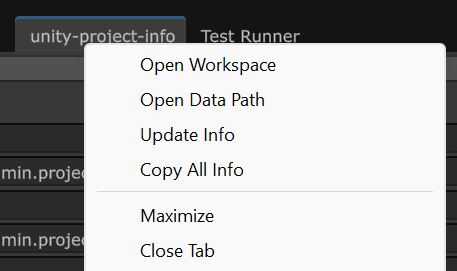
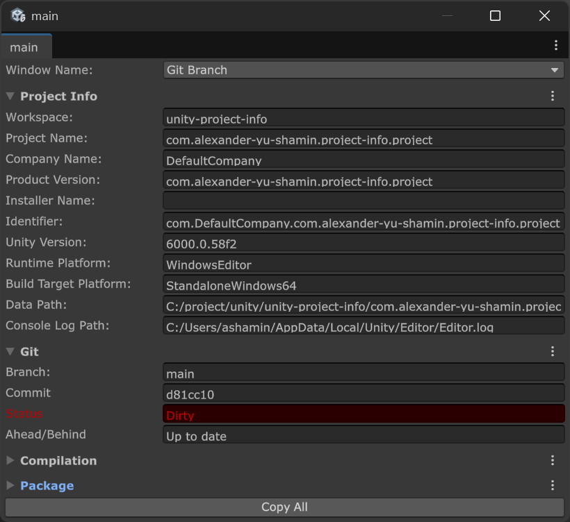

&nbsp;

&nbsp;

&nbsp;

# Project Info

A lightweight Unity Editor tool that shows essential project statistics in a clean, compact window. 
Perfect for quick insights without digging through menus.

Capabilities:
- Saves its state between sessions
- Quickly copy all parameters or only the selected ones
- Right-click context menu to quickly open the Workspace or Data path folders

# How to Use

- Window ➡ General ➡ Project Info

